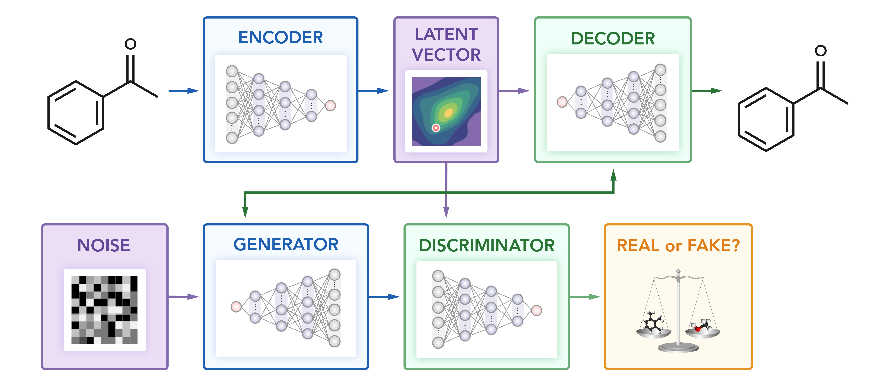

# LatentGAN

LatentGAN [1] with heteroencoder trained on ChEMBL 25 [2], which encodes SMILES strings into latent vector representations of size 512. A Wasserstein Generative Adversarial network with Gradient Penalty [3] is then trained to generate latent vectors resembling that of the training set, which are then decoded using the heteroencoder. The code has been confirmed to work with the environment provided in the `environment.yml` provided, but not all packages might be necessary. Refactoring the code to follow the other baselines is a Work in Progess. 

General Usage Instructions
--------------------------

1) Encode SMILES (`Encode.py`): Gives a .latent file of latent vectors from a given SMILES file. Currently only accepts SMILES of token size smaller than 128.  

2) Create Model (`create_model.py`): Creates blank model files generator.txt and discriminator.txt  based on an input .latent file. 

~~~~
Arguments: 
-i .latent file, 
-o path to directory you want to place the models in. 
~~~~

3) Train Model (`train_model.py`): Trains generator/discriminator with the specified parameters. Will also create .json logfiles of generator and discriminator losses. 
~~~~
Arguments:
-i .latent file. 
-o model directory path.
--n-epochs Number of epochs to train for.
--starting-epoch Model checkpoint epoch to start training from, if checkpoints exist. 
--batch-size Batch size of latent vectors, Default: 64. 
--save-interval How often to save model checkpoints. 
--sample-after-training Give how many latent vectors for the model to sample after the last epoch has finished training. Default: 0.
--decode-mols-save-path Give output path for SMILES file if you want your sampled latent vectors decoded. 
--n-critic-number Number of of times discriminator will train between each generator number. Default: 5.
--lr learning rate, Default: 2e-4. 
--b1,--b2 ADAM optimizer constants. Default 0.5 and 0.9, respectively.
-m Message to print into the logfile. 
~~~~

4) Sample Model (`sample.py`): Samples an already trained model for a given number of latent vectors. 
~~~~
Arguments: 
-l input generator checkpoint file. 
-olf path to output .latent file -n number of latent vectors to sample. 
-d Option to also decode the latent vectors to SMILES. 
-odsf output path to SMILES file. 
-m message to print in logfile.
~~~~

5) Decode Model (`decode.py`) decodes a .latent file to SMILES. 
~~~~
Arguments 
-l input .latent file. 
-o output SMILES file path. 
-m message to print in logfile.
~~~~

## Links

[1] [A De Novo Molecular Generation Method Using Latent Vector Based Generative Adversarial Network](https://chemrxiv.org/articles/A_De_Novo_Molecular_Generation_Method_Using_Latent_Vector_Based_Generative_Adversarial_Network/8299544)

[2] [ChEMBL](https://www.ebi.ac.uk/chembl/)

[3] [Improved training of Wasserstein GANs](https://arxiv.org/abs/1704.00028)

